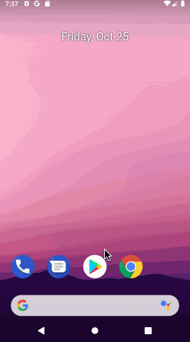
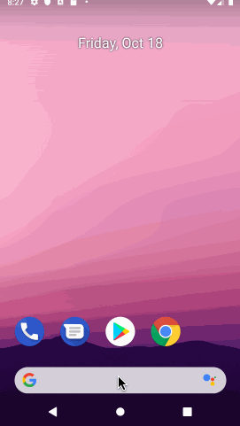
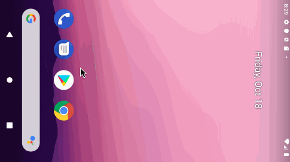

# Flix
Flix is an app that allows users to browse movies from the [The Movie Database API](http://docs.themoviedb.apiary.io/#).

## Flix Part 2

### User Stories

#### REQUIRED (10pts)

- [x] (8pts) Expose details of movie (ratings using RatingBar, popularity, and synopsis) in a separate activity.
- [x] (2pts) Allow video posts to be played in full-screen using the YouTubePlayerView.

#### BONUS

- [ ] Trailers for popular movies are played automatically when the movie is selected (1 point).
  - [ ] When clicking on a popular movie (i.e. a movie voted for more than 5 stars) the video should be played immediately.
  - [ ] Less popular videos rely on the detailed page should show an image preview that can initiate playing a YouTube video.
- [ ] Add a play icon overlay to popular movies to indicate that the movie can be played (1 point).
- [ ] Apply the popular ButterKnife annotation library to reduce view boilerplate. (1 point)
- [ ] Add a rounded corners for the images using the Glide transformations. (1 point)

### App Walkthough GIF

 

GIF created with [LiceCap](http://www.cockos.com/licecap/).

### Notes

A challenge I faced while working on the app was when my app kept crashing after building. I figured out that the issue was that I had changed the wrong RelativeLayout id. Another challenging part was getting the backgrounds to overlay each other and getting the rounded corners to match with the current design of the app, both of which I ended up scrapping since I thought that a gradient may be nicer and having rounded corners when everything else is sharp didn't seem visually appealing.

## Open-source libraries used
- [Android Async HTTP](https://github.com/codepath/CPAsyncHttpClient) - Simple asynchronous HTTP requests with JSON parsing
- [Glide](https://github.com/bumptech/glide) - Image loading and caching library for Android

---

## Flix Part 1

### User Stories

#### REQUIRED (10pts)
- [x] (10pts) User can view a list of movies (title, poster image, and overview) currently playing in theaters from the Movie Database API.

#### BONUS
- [x] (2pts) Views should be responsive for both landscape/portrait mode.
   - [x] (1pt) In portrait mode, the poster image, title, and movie overview is shown.
   - [x] (1pt) In landscape mode, the rotated alternate layout should use the backdrop image instead and show the title and movie overview to the right of it.

- [ ] (2pts) Display a nice default [placeholder graphic](https://guides.codepath.org/android/Displaying-Images-with-the-Glide-Library#advanced-usage) for each image during loading
- [x] (2pts) Improved the user interface by experimenting with styling and coloring.
- [ ] (2pts) For popular movies (i.e. a movie voted for more than 5 stars), the full backdrop image is displayed. Otherwise, a poster image, the movie title, and overview is listed. Use Heterogenous RecyclerViews and use different ViewHolder layout files for popular movies and less popular ones.

### App Walkthough GIF

#### Required User Stories Walkthrough
 

#### Bonus User Story: Landscape Mode
 

GIF created with [LiceCap](http://www.cockos.com/licecap/).

### Notes
A challenge that I had while working on this app was figuring out why the movies would not show up on the screen. I found that the issue was that I was returning 0 in getting the item count rather than the total number of movies in the list. 

### Open-source libraries used

- [Android Async HTTP](https://github.com/codepath/CPAsyncHttpClient) - Simple asynchronous HTTP requests with JSON parsing
- [Glide](https://github.com/bumptech/glide) - Image loading and caching library for Androids
